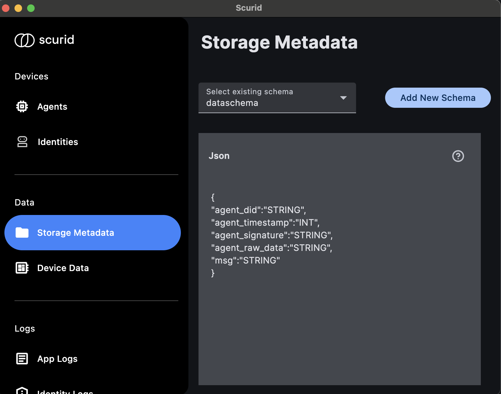

# Python App: Data Transfer
This folder contains a sample app for the following feature to be done on edge devices that run with an OS.

1. Enables an Edge device to send data through the edge agent to the Scurid server which can be further stored in the database on the server. 

## Dependency installation
```
pip3 install -r requirements.txt
```
## Prerequisite
1. The Scurid Server shall be up and running. See [here](https://docs.scurid.com/v23.0.2.1/quickstart/quickstart-on-premise/#download-scurid-server) for details.
2. The Scurid App is onboarded and is connected to the Scurid Server. See [here](https://docs.scurid.com/v23.0.2.1/quickstart/quickstart-on-premise/#download-scurid-edge-agent) for details.
3. The Scurid Edge Agent is up and Approved by the Scurid App. See [here](https://docs.scurid.com/v23.0.2.1/quickstart/quickstart-on-premise/#step-2-launching-scurid-server-and-app) for details.
4. The Scurid Edge Agent should be assigned a suitable schema as per the requirements. Below is the sample schema used in a use case.

## Screenshot



## Steps to execute the example
```
python3 main.py did:scurid:0xCd1C883c70e848350616573cAC45f549840BfEba
```

The command line argument did:scurid:0xCd1C883c70e848350616573cAC45f549840BfEba is the edge device identity.

Upon execution of the above command a selection menu appears on the terminal

```
1. Send Data
2. Exit

Select your operation 1
```
### Send Data
```
Enter your message: man mohan 
```
```
result: true

```
The true response indicates that the message is received by the server and is inserted into the database.

Below is the snapshot of entries in the database.

```
agent_signature                                                            |    agent_raw_data     |     msg     |                       agent_did                       |   agent_timestamp
---------------------------------------------------------------------------------------------------------------------------------------+-----------------------+-------------+-------------------------------------------------------+----------------------
  0x41fb3c36c67040b2aaf1137305aea8fc90e8a3fa76c4503c41344f3d7339aa304a02e16e5e88fa3c7c4de5095dfc080fb7dfed8acefe83344923a71327940ea81c | {"msg":"success"}     | success     | did:scurid:0xCd1C883c70e848350616573cAC45f549840BfEba | 1734018174936458000
  0xd40864208db4312a4b870acdca9f840cc6c1f9a7b0b945984beefb16a6d2026b177c6b361c6d86c70011a8051c20bd81aeed271b90f8674097408fd18f2632441b | {"msg":"yami gautam"} | yami gautam | did:scurid:0xCd1C883c70e848350616573cAC45f549840BfEba | 1734018607159847000
  0x934f937970dacebcb26809fcd36572eec01326275e3390d4089c1b5c3d19c13c13035135e8dccd9e2ab4f9b97a9db5a2f1f1c39239e245128ab21fef92fed34e1c | {"msg":"man mohan "}  | man mohan   | did:scurid:0xCd1C883c70e848350616573cAC45f549840BfEba | 1734019330368280000
(3 rows)

Time: 15ms total (execution 13ms / network 2ms)
```